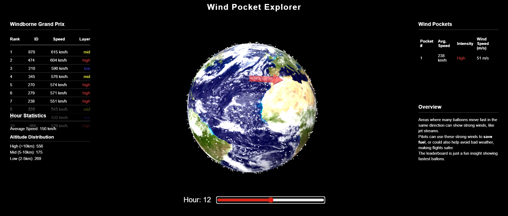

# Wind Pocket Explorer

Just a fun weekend project I made to play around with Windborne's balloon data and Three.js. It maps balloon coordinates on a 3D globe and highlights "wind pockets" by detecting clusters of fast-moving balloons.

> Note: The live demo uses a data snapshot to ensure consistent performance without requiring active API.

## Overview

This project takes raw balloon telemetry data and plots it onto an interactive 3D globe. By comparing the coordinates of each balloon between timeframes, it calculates their speed and direction to derive where the fastest winds ("wind pockets") are actually happening.

Finally, it correlates this telemetry with live weather forecasts from the Open-Meteo API at those specific coordinates and altitude pressure levels (e.g., the jet stream). This allows us to compare the actual wind speeds measured by the balloons against the predicted meteorological forecast for those exact pockets.

## Tech Stack
- **HTML, CSS, JavaScript (Vanilla)**
- **Three.js** (for 3D rendering and mapping)
- **Open-Meteo API** (for fetching live wind forecast data)

## Data Architecture
The live demo uses a static snapshot of balloon data (`full_data.json`). This ensures the site loads instantly, avoids API rate limits, prevents it from breaking if external APIs go offline, and allows the app to run independently of the original, temporary API endpoint. If you want to use live tracking, you can swap the endpoint directly in the source code to run it locally.

## How to Run

Because this app fetches a local JSON file for the balloon data, you'll need to run a quick local server to handle local I/O and satisfy browser CORS policies.

If you have Python installed:
`python -m http.server 8000`

If you have Node installed:
`npx serve .`

Then just open `http://localhost:8000` in your browser.